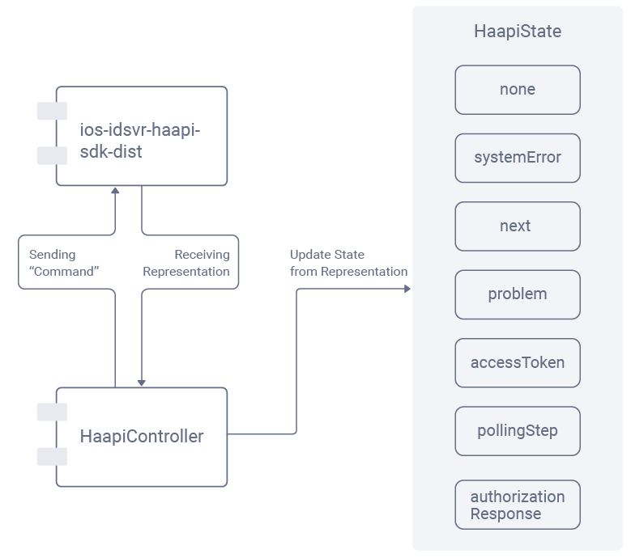
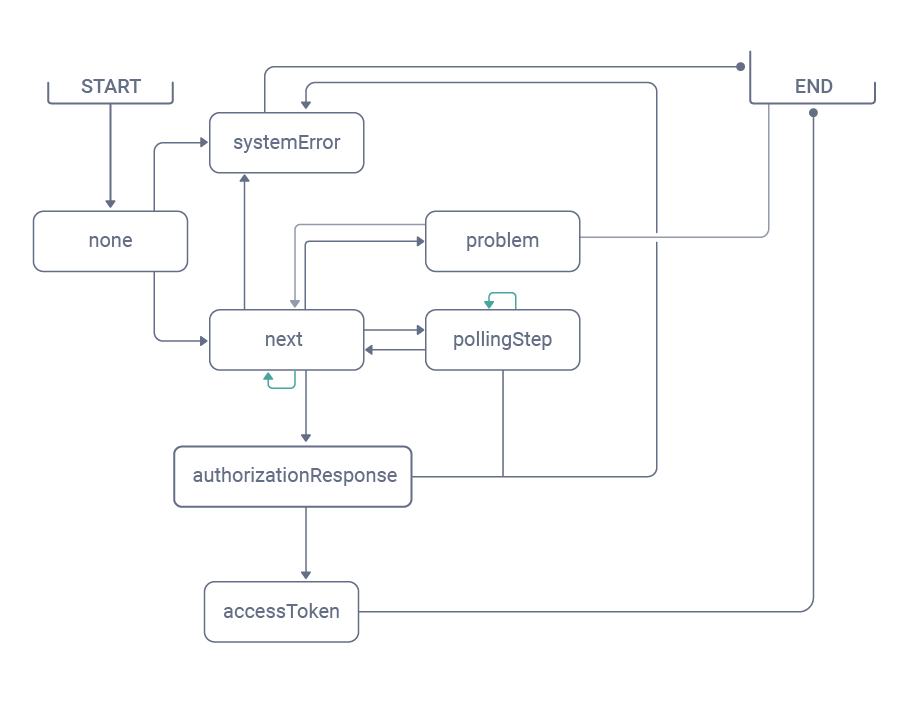

# Haapi Demo's technical details

## Dependencies

[ios-idsvr-haapi-sdk-dist](https://github.com/curityio/ios-idsvr-haapi-sdk-dist) 

## Architecture

- Model-View-ViewModel pattern

## Key classes

This is a list of classes that may help you to understand how the application was built on top of [ios-idsvr-haapi-sdk-dist](https://github.com/curityio/ios-idsvr-haapi-sdk-dist) .

### Representation (Models/Representation)

A `Representation` represents the HAAPI body of a response to an authorization request made through [ios-idsvr-haapi-sdk-dist](https://github.com/curityio/ios-idsvr-haapi-sdk-dist).

### HaapiController (Controller/HaapiController.swift)

The HaapiController is the only object that interacts directly with [ios-idsvr-haapi-sdk-dist](https://github.com/curityio/ios-idsvr-haapi-sdk-dist).

When an interaction happens with [ios-idsvr-haapi-sdk-dist](https://github.com/curityio/ios-idsvr-haapi-sdk-dist), a representation is received. An interaction is initiated by an user's action (for example, starting the flow or pushing a button). The downside of consuming directly a representation is that this object is too generic for views and state. Therefore after each interaction, HaapiController processes a representation to return a `HaapiState`. 

### HaapiState (Controller/HaapiStateContent.swift)

There are seven states:

- none: The flow has not started yet
- systemError(Error): The flow is interrupted due to a system Error
- next(HaapiStateContent): A new representation that is not a problem/error/polling/authorizationResponse or accessToken; The UI will consume the HaapiStateContent
- problem(Problem): A problem from a representation
- authorizationResponse(String): The authorization code
- accessToken([String: String]): The accessToken response; Final step
- polling(PollingStep): PollingStep

By knowing the state, the application knows which view has to be rendered. `FlowViewModel` is the main consumer of it.

### FlowViewModel (FlowViewModel.swift)

FlowViewModel is the main consumer of HaapiController and is aware of any HaapiState changes.

When a HaapiState changes, it will process the state by setting a specific ViewModel (FormViewMode, SelectoViewModel, [FormOption]). With SwiftUI mechanism, the view (`StateView`) will receive a notification when any `@Published` is updated.

### StateView (Views/StateView.swift)

StateView is the **main** view of the authentication flow. When `FlowViewModel.state` changed, the view will update according to either raw data or a specific ViewModel.

From this StateView, different content views will be rendered. These content views are:

- SelectorView: List of authenticators
- FormView: A `form` view
- PollingView: A polling view (for example the SMS authenticator uses it)
- TokensView: The final view
- AuthorizedView: A view that displays an authorization code
- A list of "ProgressRow"

## HaapiController and ios-idsvr-haapi-sdk-dist

## Flow and HaapiState

